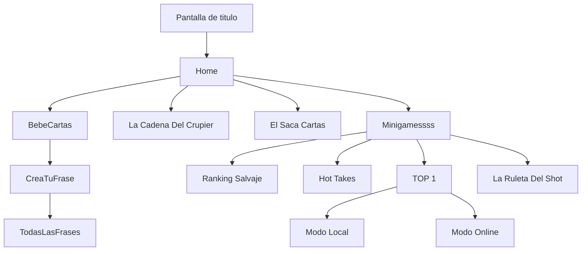

  
# LA PREVIA

Aplicación de juegos y retos sociales, perfecta para hacer LA PREVIA antes de salir de fiesta.

## Descripción General

LA PREVIA es una app que reúne una colección de minijuegos y dinámicas para grupos, pensada para calentar motores antes de salir de fiesta. Dicha app incluye juegos de cartas, preguntas y mucho alcohol.

## Tecnologías Utilizadas

- React Native (con Expo)
- Firebase
- AsyncStorage
- Navegación: React Navigation
- Librerías de UI: React Native Vector Icons, Expo Haptics, etc.

## Instalación y Ejecución

1. **Clona el repositorio:**  
   ```bash
   git clone [REPO_URL]
   cd D.A.M
   ```

2. **Instala las dependencias:**  
   ```bash
   npm install
   ```

3. **Configura Firebase:**  
   Agrega tus credenciales de Firebase en los archivos correspondientes (`firebase.json` o la configuración en el proyecto).

4. **Ejecuta la app:**  
  
   ```bash
   npx expo start --clear
   ```

5. **Abre en tu emulador o con la app Expo Go en tu dispositivo.**

## Uso General de la App

Al iniciar LA PREVIA, el usuario puede navegar entre diferentes modos de juego, retos y minijuegos. La navegación es intuitiva y cada pantalla tiene una función bien definida.

---

# Funcionamiento de Cada Pantalla

## TittleScreen

**Propósito:**  
Pantalla de bienvenida de la app.

**Funcionamiento:**  
Pantalla de bienvenida, la cual simula una jarra de cerveza con el nombre de la app 'LA PREVIA'

---

## HomeScreen

**Propósito:**  
Menú principal de la aplicación.

**Funcionamiento:**  
Permite navegar a los distintos modos de juego y minijuegos. En ella podrás añadir también los borrachos que jugaran.

---


## MiniGamesScreen

**Propósito:**  
Selector de minijuegos adicionales.

**Funcionamiento:**  
Permite explorar y acceder a diferentes minijuegos cortos. Muestra una lista visual para empezar cada uno.

---

## GameOneScreen

**Propósito:**  
Juego principal tipo cartas.

**Funcionamiento:**  
Muestra una baraja de cartas y asigna retos aleatorios según la carta que se saque. Incluye lógica para mostrar imágenes de cartas, reglas asociadas, y pasar turno entre jugadores. La versión “Prueba” es para testeo de nuevas reglas o diseños.

---

## GameTwoScreen / PruebaGameTwoScreen

**Propósito:**  
Segundo juego de cartas o dinámicas.

**Funcionamiento:**  
Mecánica similar al anterior pero con otras reglas, barajas o retos. Incluye lógica de barajado, interacción visual, y turnos. La versión “Prueba” sirve para testear cambios o nuevos retos.

---

## GameThreeScreen

**Propósito:**  
Juego de retos aleatorios tipo ruleta.

**Funcionamiento:**  
Muestra una ruleta animada que, al girar, selecciona un reto o castigo aleatorio para el jugador. Usa animaciones, vibraciones y efectos visuales.

---

## GameFourScreen / PruebaGameFourScreen

**Propósito:**  
Juego de retos usando “Swiper” de cartas o frases.

**Funcionamiento:**  
Permite al usuario deslizar tarjetas con retos o frases (tipo Tinder). Cada swipe ejecuta un reto o acción. La versión “Prueba” es para validar nuevos retos o cambios en la dinámica.

---

## CreaTuFrase

**Propósito:**  
Pantalla para crear frases personalizadas.

**Funcionamiento:**  
Permite al usuario escribir una frase y guardarla en Firebase. Luego puede aparecer en los retos o dinámicas de la app.

---

## TodasLasFrasesScreen

**Propósito:**  
Ver y gestionar todas las frases creadas.

**Funcionamiento:**  
Muestra una lista de todas las frases (personalizadas y predeterminadas). Permite buscar, filtrar, borrar o editar frases.

---

## MiniGames (MiniGame1, MiniGame2, MiniGame4)

**Propósito:**  
Colección de minijuegos cortos.

**Funcionamiento:**  
Cada mini-juego tiene una dinámica única, independiente de los juegos principales. Ejemplos comunes: preguntas rápidas, retos exprés, memoria, reacción, etc.

---


## Diagrama de Navegación (Mermaid UML)

Puedes visualizar la navegación entre pantallas de la app con el siguiente diagrama:



# Créditos

- Autor: [Tu Nombre o Equipo]
- Contacto: [Tu Email o enlace de redes]

# Licencia

MIT

---
